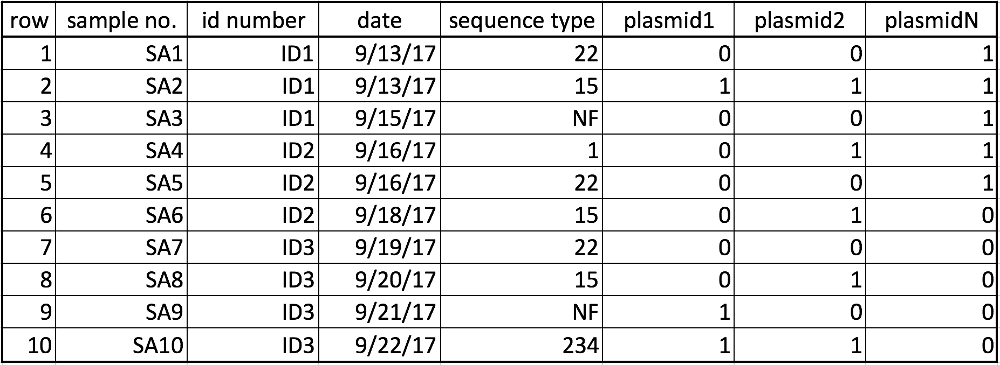
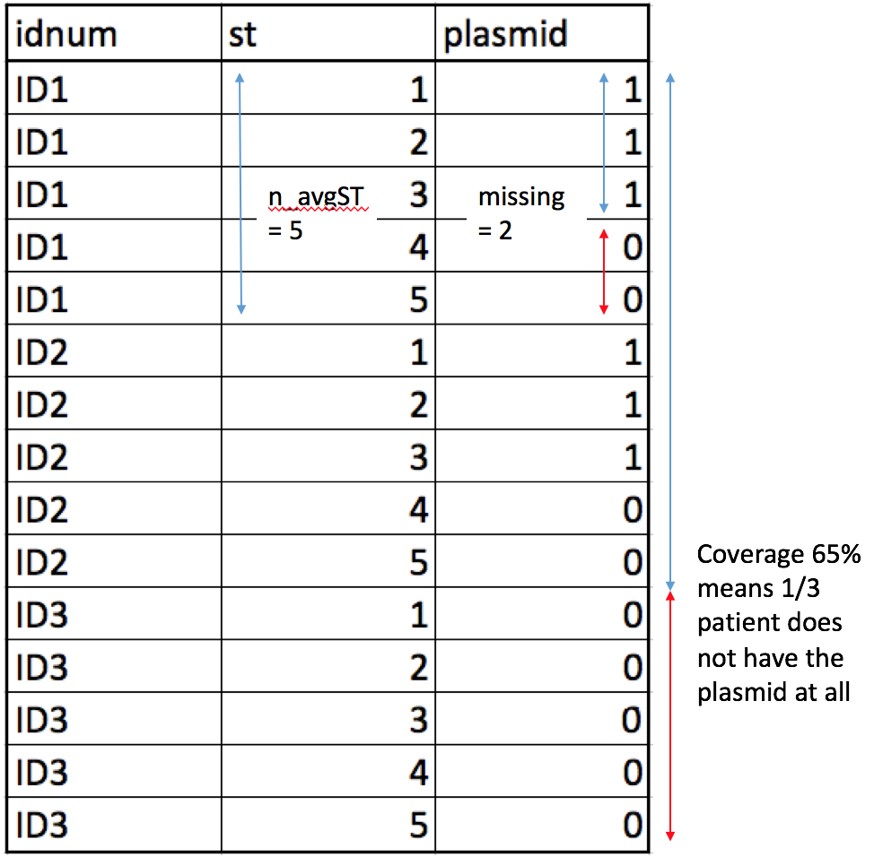
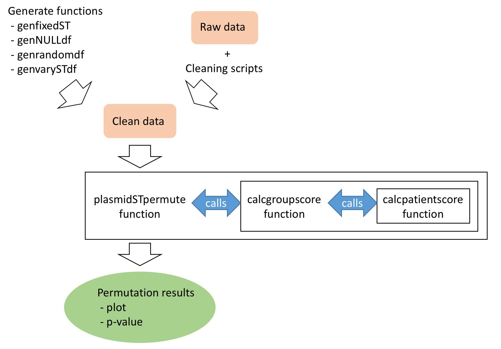

### Index of Contents

* [Dependencies](#dependencies) - r packages required and versioning
* [Method](#method) - algorithm used to perform this permutation test in diagrams
* [Data Structure](#data_structure) - data structure expected to use the functions given for this test
* [Files & Functions](#files_functions) - description of each files in repository and collection of comments from each function
* [Workflow](#workflow) - how the functions and data structures fit together
* [Validation](#validation) - proof that this test can be trusted
* [Example Scripts](#example_scripts) - basic example of usage

### Dependencies 

Newer versions might work also, but these are timestop versions (as is when this test was created).

- plyr v1.8.4
- dplyr v0.5.0
- tidyr v0.6.3
- ggplot2 v2.2.1

To install current versions: `install.packages("plyr")`

If the current versions do not work, you may find their source codes under the packages folder in this repository.

To add r packages from source:

`install.packages(path_to_file, repos = NULL, type="source")`

or

`R CMD INSTALL package.tar.gz`

### Method 

What it does is, it looks for the likelihood of finding the same plasmid in different STs within the same patient. Potential horizontal transfer is defined as the likelihood of finding the same plasmid across other STs in the same patient. To quantify this, scoring for each patient and sample population is defined as such:

Each patient has some amount of STs, and multiple samples of each ST. Consider 1 to mean, in that sample the plasmid we are looking for is found, and 0 to mean not found. This can be used to consider phenotypes in the same way, 1 if phenotype is present, 0 if not. Because we only care whether an ST ever has the plasmid at any point in time or not, STs are OR across samples. 
 
A patient score is then calculated for each patient by simply finding the average of the result OR across samples minus 1 to both nominator and denominator. This gives us a score on the range of 0-1, where 0 means no plasmid is present in the patient in any ST, and 1 means the patient has the plasmid in question in all STs found in the patient.
 
A group score used to compare between the actual data and distribution of shuffled STs (n = 10,000) is calculated by finding the average score among only patients that have a patient score > 0 (has the plasmid at least once in some ST at some time). 
 
Permutation shuffling is done by only shuffling samples in their own ST as in the picture below.

P-value is obtained from a one-tailed test.

### Data Structure 

Example data structure expected. A cleaned version of phenotype and plasmid data used in this analysis can be found in the `data` folder.

A data structure generated from one of the functions provided will look as such:

More details on each function can be found under [Files & Functions](#files_functions) or in source.

### Workflow 

This section shows how each functions are meant to be used together in a workflow.

### Files & Functions 

This functions contains descriptions for each file and function. These descriptions can also be found with each function source comment.

#### Files

TestResults_cache
data
images
packages
pheno_permute_loose_results
pheno_permute_tight_results
plasmid_permute_results
validation

#### Functions

### Validation 

Raw p-value distribution under the null hypothesis should be uniform.

The `validation` folder contains the entire body of work and method. See validation.Rmd and it's corresponding html file for report.

### Example Scripts

