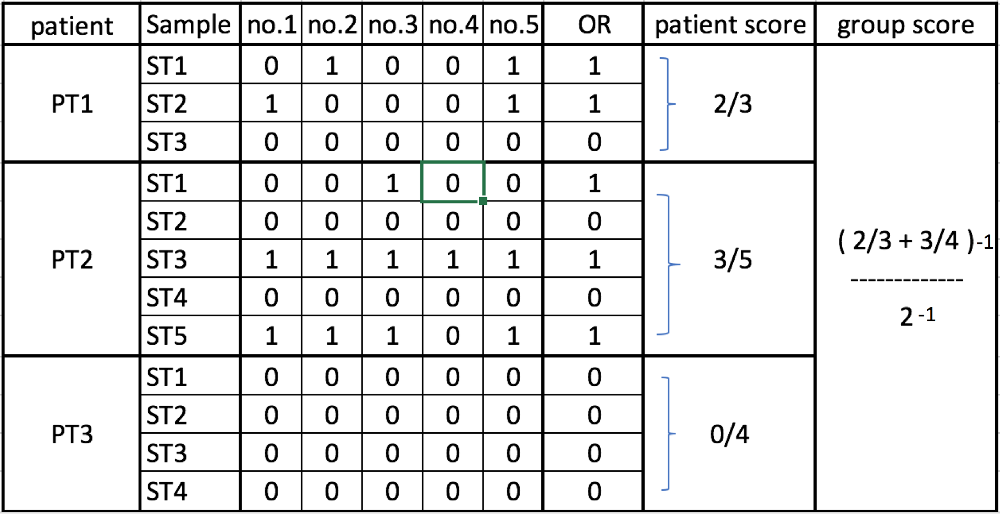
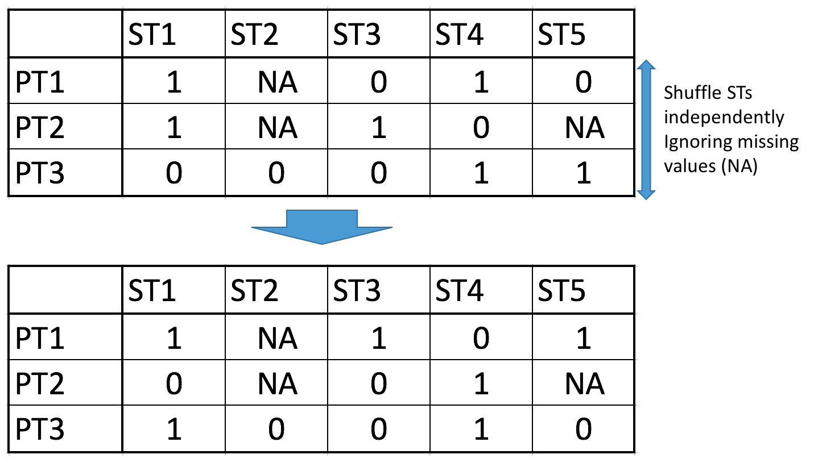

###Index

* [Dependencies](#dependencies) - _r packages required and versioning_
* [Method](#method) - _algorithm used to perform this permutation test in diagrams_
* [Data Structure](#data_structure) - _data structure expected to use the functions given for this test_
* [Files & Functions](#files_functions) - _description of each files in repository and collection of comments from each function_
* [Workflow](#workflow) - _how the functions and data structures fit together_
* [Validation](#validation) - _proof that this test can be used_
* [Example Scripts](#example_scripts) - _basic example of usage_

### Dependencies 
(check if true dependency)

Newer versions might work also, but these are timestop versions (as is when this test was created).

- plyr v1.8.4
- dplyr v0.5.0
- tidyr v0.6.3
- ggplot2 v2.2.1

To install current versions: `install.packages("plyr")`

If the current versions do not work, you may find their source codes under the packages folder in this repository.

To add r packages from source:

`install.packages(path_to_file, repos = NULL, type="source")`

or

`R CMD INSTALL package.tar.gz`

### Method 

This section describes the algorithm used to perform this permutation test in diagrams.

What it does is, it looks for the likelihood of finding the same plasmid in different STs within the same patient.

### Data Structure 

[data structure w/ context]

[data structure w/o context]

[generated data structures]

### Workflow 

This section shows how each functions are meant to be used together in a workflow.

[Workflow]

### Files & Functions 

This functions contains descriptions for each file and function. These descriptions can also be found with each function source comment.

functions.R

p_functions.R

validation.Rmd

### Validation 

This section goes over why we can trust this test.

### Example Scripts 