### Start analysis, load dependencies and functions

```{r dependencies, message=FALSE}
#setwd('~/Plasmid_ST_Permutation_Test')

library(plyr)
library(dplyr)
library(tidyr)
library(ggplot2)
```

```{r init, echo = FALSE}
permute_iter = 1e4
```

```{r functions message}
# Load functions...
# See Rmd source for more
```

```{r functions, echo=FALSE}
source('functions.R')
```

### Results

##### Plasmids: Likelihood of finding the same plasmid across all STs in the same patient 

```{r plasmid preprocessing, include=FALSE, cache=TRUE}
plasdat <- read.csv('./data/plasmid_data.csv')
plasdat <- subset(plasdat, select = -1)
```

```{r plasmid results, include=FALSE, cache=TRUE}
# subset FIA plasmid (INPUT)
FIA <- select(plasdat, -c(6:19))
FIA_ss <- plasmidSTpermute(FIA, permute_iter)

# subset FIBK_Kpn3 plasmid
FIBK <- select(plasdat, -c(5,7:19))
FIBK_ss <- plasmidSTpermute(FIBK, permute_iter)

# subset FIBMar plasmid
FIBMar <- select(plasdat, -c(5:6,8:19))
FIBMar_ss <- plasmidSTpermute(FIBMar, permute_iter)

# subset FIBpKPHS1_pKPHS1 plasmid
FIBpKPHS1 <- select(plasdat, -c(5:7,9:19))
FIBpKPHS1_ss <- plasmidSTpermute(FIBpKPHS1, permute_iter)

# subset FIIK plasmid
FIIK <- select(plasdat, -c(5:8,10:19))
FIIK_ss <- plasmidSTpermute(FIIK, permute_iter)

# subset FII_1 plasmid
FII1 <- select(plasdat, -c(5:9,11:19))
FII1_ss <- plasmidSTpermute(FII1, permute_iter)
png("./plasmid_permute_results/FII1.png")
print(FII1_ss)
dev.off()

# subset FIIpCTU2_pCTU2 plasmid
FIIpCTU <- select(plasdat, -c(5:10,12:19))
FIIpCTU_ss <- plasmidSTpermute(FIIpCTU, permute_iter)

# subset HI1B plasmid
HI1B <- select(plasdat, -c(5:11,13:19))
HI1B_ss <- plasmidSTpermute(HI1B, permute_iter)

# subset HI2 plasmid
HI2 <- select(plasdat, -c(5:12,14:19))
HI2_ss <- plasmidSTpermute(HI2, permute_iter)

# subset HI2A_1 plasmid
HI2A <- select(plasdat, -c(5:13,15:19))
HI2A_ss <- plasmidSTpermute(HI2A, permute_iter)

# subset N plasmid
N <- select(plasdat, -c(5:14,16:19))
N_ss <- plasmidSTpermute(N, permute_iter)

# subset N2 plasmid
N2 <- select(plasdat, -c(5:15,17:19))
N2_ss <- plasmidSTpermute(N2, permute_iter)

# subset P_alpha plasmid
P_alpha <- select(plasdat, -c(5:16,18:19))
P_alpha_ss <- plasmidSTpermute(P_alpha, permute_iter)

# subset Q1 plasmid
Q1 <- select(plasdat, -c(5:17,19))
Q1_ss <- plasmidSTpermute(Q1, permute_iter)

# subset R plasmid
R <- select(plasdat, -c(5:18))
R_ss <- plasmidSTpermute(R, permute_iter)
```

```{r print 6, include=FALSE}
png("./plasmid_permute_results/FIA.png")
print(FIA_ss)
dev.off()

png("./plasmid_permute_results/FIBK.png")
print(FIBK_ss)
dev.off()

png("./plasmid_permute_results/FIBMar.png")
print(FIBMar_ss)
dev.off()

png("./plasmid_permute_results/FIBpKPHS1.png")
print(FIBpKPHS1_ss)
dev.off()

png("./plasmid_permute_results/FIIK.png")
print(FIIK_ss)
dev.off()

png("./plasmid_permute_results/FII1.png")
print(FII1_ss)
dev.off()

png("./plasmid_permute_results/FIIpCTU.png")
print(FIIpCTU_ss)
dev.off()

png("./plasmid_permute_results/HI1B.png")
print(HI1B_ss)
dev.off()

png("./plasmid_permute_results/HI2.png")
print(HI2_ss)
dev.off()

png("./plasmid_permute_results/HI2A.png")
print(HI2A_ss)
dev.off()

png("./plasmid_permute_results/N.png")
print(N_ss)
dev.off()

png("./plasmid_permute_results/N2.png")
print(N2_ss)
dev.off()

png("./plasmid_permute_results/P_alpha.png")
print(P_alpha_ss)
dev.off()

png("./plasmid_permute_results/Q1.png")
print(Q1_ss)
dev.off()

png("./plasmid_permute_results/R.png")
print(R_ss)
dev.off()
```

|||
-------|--------|---------|
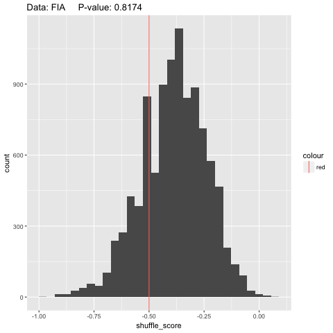 | 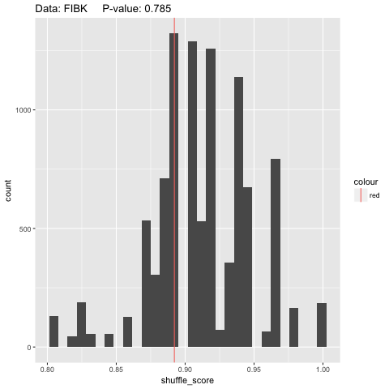 | 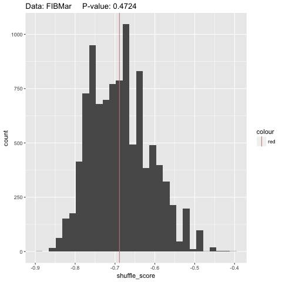 |
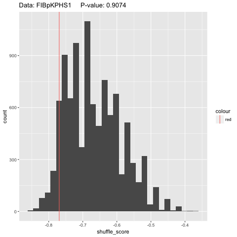 | 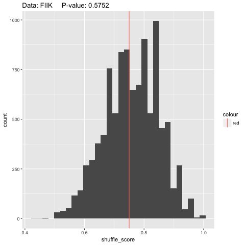 | 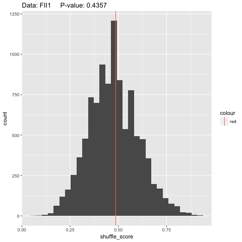 |
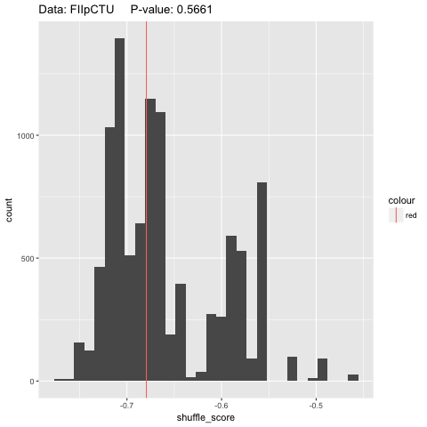 | 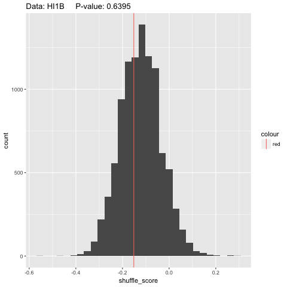 |  |
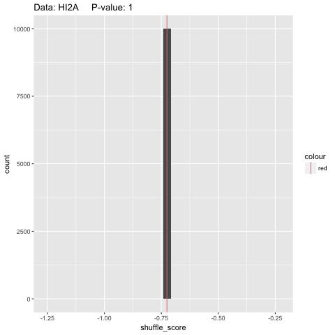 | 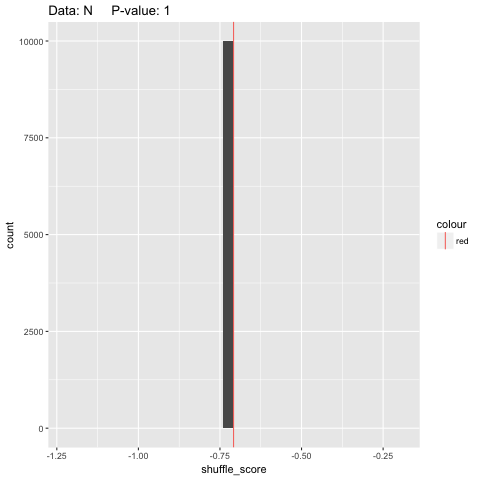 | 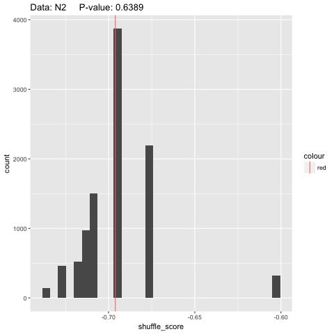 |
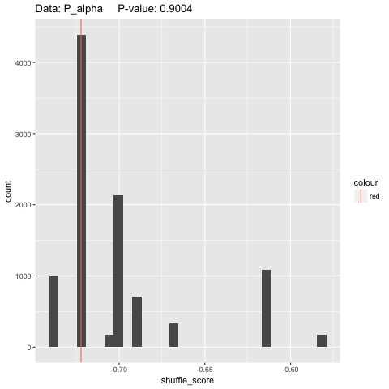 | 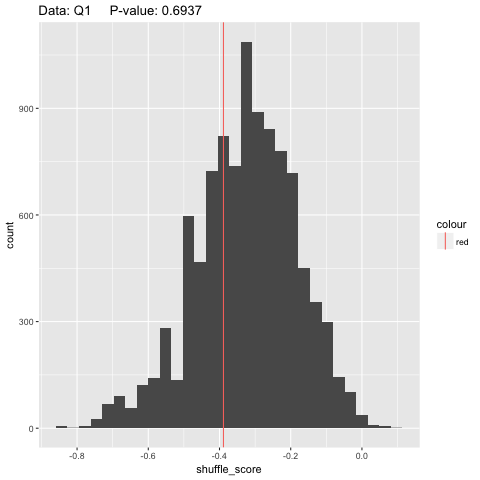 | 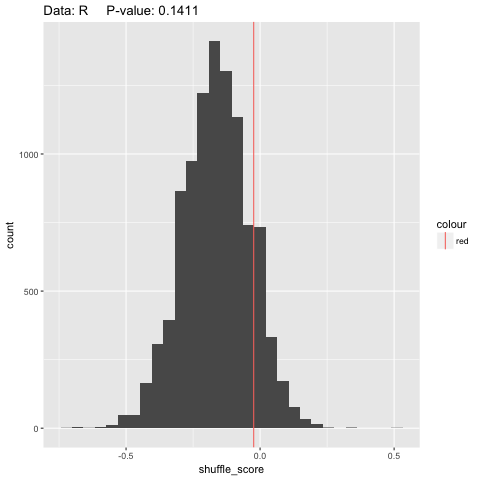 |  

Plasmid | Incompatability Group | p-value ||
--------| ------------------- | --------|-----|
FIA | FIA |  | |
FIBK | FIB |  | |
FIBMar | FIB | | |
FIBpKPHS1 | FIB |  | |
FIIK | FII |  |  |
FII1 | FII |  | |
FIIpCTU | FII |  | |
HI1B | HI1 |  | |
HI2 | HI2 |  | |
HI2A | HI2 |  | |
N | N |  | |
N2 | N | | |
P$\alpha$ | P$\alpha$ |  | |
Q1 | Q |  | |
R | R |  | |  

##### Phenotypes: Likelihood of finding the same phenotypes across all STs in the same patient

Tighter acceptance of resistance definition, from RIS, I is considered the same as S.

```{r phenotype preprocessing (tighter), include=FALSE, cache=TRUE}
phenodat <- read.csv('./data/phenotype_data.csv', stringsAsFactors = FALSE)
phenodat <- subset(phenodat, select = -1)

phenodat$specdate = as.character(phenodat$specdate)

# Tighter acceptance of resistance definition
phenodat[phenodat == 'R'] <- 1
phenodat[phenodat == 'I'] <- 0
phenodat[phenodat == 'S'] <- 0

# covert all columns with phenotypes into numeric for alpha
ix <- 5:length(phenodat)
phenodat[ix] <- lapply(phenodat[ix], as.numeric)

phenodat$specdate = as.Date(phenodat$specdate, format="%Y-%m-%d")
```

```{r phenotype results (tighter), include=FALSE, cache=TRUE}
# subset amp resistance (INPUT)
amp <- select(phenodat, -c(6:15))
amp_ss <- plasmidSTpermute(amp, permute_iter)

# subset amc resistance
amc <- select(phenodat, -c(5, 7:15))
amc_ss <- plasmidSTpermute(amc, permute_iter)

# subset cro resistance
cro <- select(phenodat, -c(5:6, 8:15))
cro_ss <- plasmidSTpermute(cro, permute_iter)

# subset cip resistance
cip <- select(phenodat, -c(5:7, 9:15))
cip_ss <- plasmidSTpermute(cip, permute_iter)

# subset cn resistance
cn <- select(phenodat, -c(5:8, 10:15))
cn_ss <- plasmidSTpermute(cn, permute_iter)

# subset sxt resistance
sxt <- select(phenodat, -c(5:9, 11:15))
sxt_ss <- plasmidSTpermute(sxt, permute_iter)

# subset caz resistance
caz <- select(phenodat, -c(5:10, 12:15))
caz_ss <- plasmidSTpermute(caz, permute_iter)

# subset c resistance
c <- select(phenodat, -c(5:11, 13:15))
c_ss <- plasmidSTpermute(c, permute_iter)

# subset ipm resistance
ipm <- select(phenodat, -c(5:12, 14:15))
ipm_ss <- plasmidSTpermute(ipm, permute_iter)

# subset cpd resistance
cpd <- select(phenodat, -c(5:13, 15))
cpd_ss <- plasmidSTpermute(cpd, permute_iter)

# subset f resistance
f <- select(phenodat, -c(5:14))
f_ss <- plasmidSTpermute(f, permute_iter)
```

```{r print 7, include=FALSE}
png("./pheno_permute_tight_results/amp.png")
print(amp_ss)
dev.off()

png("./pheno_permute_tight_results/amc.png")
print(amc_ss)
dev.off()

png("./pheno_permute_tight_results/cro.png")
print(cro_ss)
dev.off()

png("./pheno_permute_tight_results/cip.png")
print(cip_ss)
dev.off()

png("./pheno_permute_tight_results/cn.png")
print(cn_ss)
dev.off()

png("./pheno_permute_tight_results/sxt.png")
print(sxt_ss)
dev.off()

png("./pheno_permute_tight_results/caz.png")
print(caz_ss)
dev.off()

png("./pheno_permute_tight_results/c.png")
print(c_ss)
dev.off()

png("./pheno_permute_tight_results/ipm.png")
print(ipm_ss)
dev.off()

png("./pheno_permute_tight_results/cpd.png")
print(cpd_ss)
dev.off()

png("./pheno_permute_tight_results/f.png")
print(f_ss)
dev.off()
```

|||
-------|--------|---------|
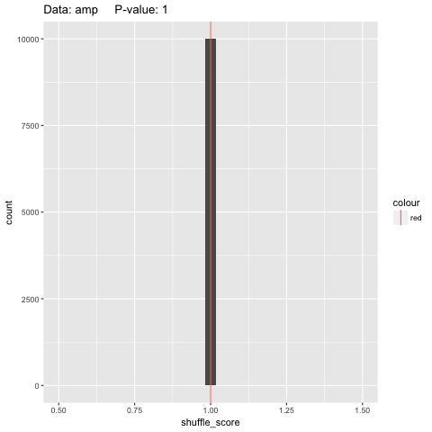 | 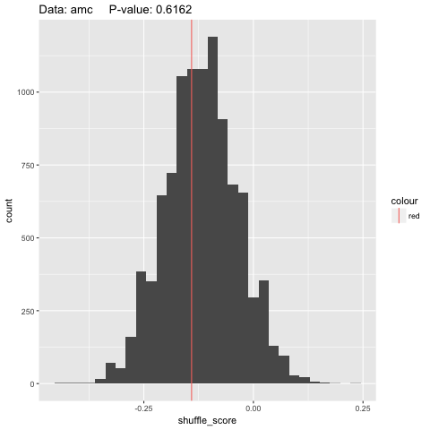 | 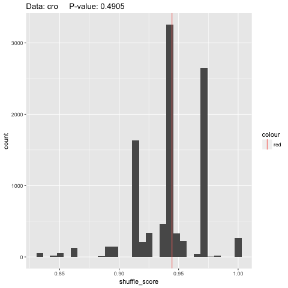 |
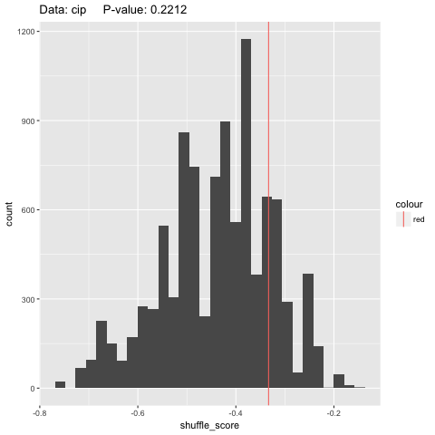 | 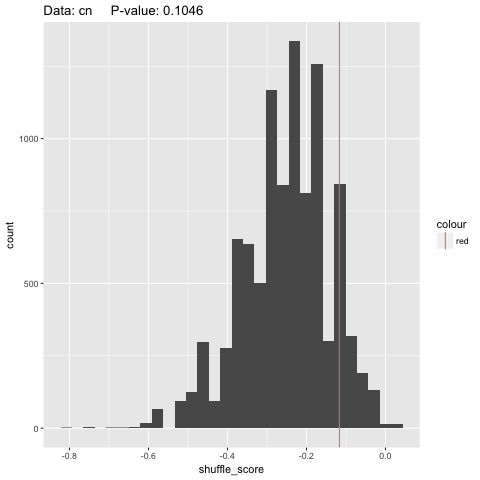 | 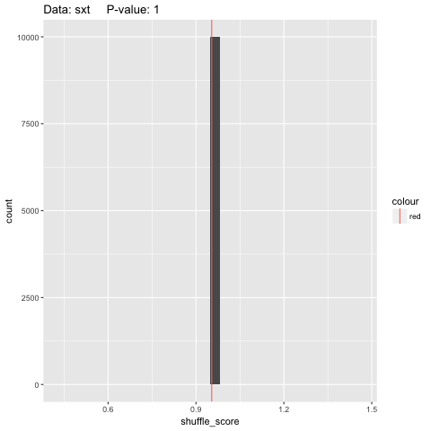 |
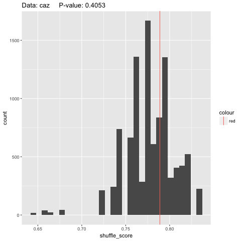 | 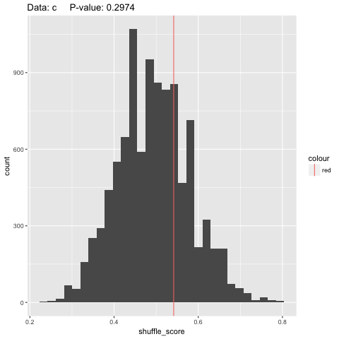 | 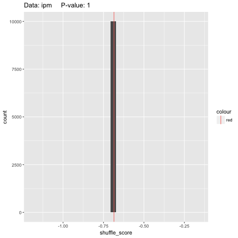 |
 | 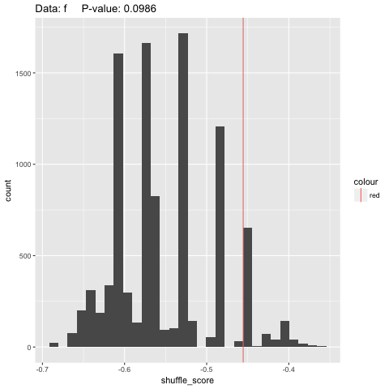 |  |
 
Wider acceptance of resistance definition, from RIS, I is considered the same as R.

```{r phenotype preprocessing (wider), include=FALSE, cache=TRUE}
phenodat <- read.csv('./data/phenotype_data.csv', stringsAsFactors = FALSE)
phenodat <- subset(phenodat, select = -1)

phenodat$specdate = as.character(phenodat$specdate)

# Tighter acceptance of resistance definition
phenodat[phenodat == 'R'] <- 1
phenodat[phenodat == 'I'] <- 1
phenodat[phenodat == 'S'] <- 0

# covert all columns with phenotypes into numeric for alpha
ix <- 5:length(phenodat)
phenodat[ix] <- lapply(phenodat[ix], as.numeric)

phenodat$specdate = as.Date(phenodat$specdate, format="%Y-%m-%d")
```

```{r phenotype results (wider), include=FALSE, cache=TRUE}
# subset amp resistance (INPUT)
amp <- select(phenodat, -c(6:15))
amp_ss <- plasmidSTpermute(amp, permute_iter)

# subset amc resistance
amc <- select(phenodat, -c(5, 7:15))
amc_ss <- plasmidSTpermute(amc, permute_iter)

# subset cro resistance
cro <- select(phenodat, -c(5:6, 8:15))
cro_ss <- plasmidSTpermute(cro, permute_iter)

# subset cip resistance
cip <- select(phenodat, -c(5:7, 9:15))
cip_ss <- plasmidSTpermute(cip, permute_iter)

# subset cn resistance
cn <- select(phenodat, -c(5:8, 10:15))
cn_ss <- plasmidSTpermute(cn, permute_iter)

# subset sxt resistance
sxt <- select(phenodat, -c(5:9, 11:15))
sxt_ss <- plasmidSTpermute(sxt, permute_iter)

# subset caz resistance
caz <- select(phenodat, -c(5:10, 12:15))
caz_ss <- plasmidSTpermute(caz, permute_iter)

# subset c resistance
c <- select(phenodat, -c(5:11, 13:15))
c_ss <- plasmidSTpermute(c, permute_iter)

# subset ipm resistance
ipm <- select(phenodat, -c(5:12, 14:15))
ipm_ss <- plasmidSTpermute(ipm, permute_iter)

# subset cpd resistance
cpd <- select(phenodat, -c(5:13, 15))
cpd_ss <- plasmidSTpermute(cpd, permute_iter)

# subset f resistance
f <- select(phenodat, -c(5:14))
f_ss <- plasmidSTpermute(f, permute_iter)
```

```{r print 8, include=FALSE}
png("./pheno_permute_loose_results/amp.png")
print(amp_ss)
dev.off()

png("./pheno_permute_loose_results/amc.png")
print(amc_ss)
dev.off()

png("./pheno_permute_loose_results/cro.png")
print(cro_ss)
dev.off()

png("./pheno_permute_loose_results/cip.png")
print(cip_ss)
dev.off()

png("./pheno_permute_loose_results/cn.png")
print(cn_ss)
dev.off()

png("./pheno_permute_loose_results/sxt.png")
print(sxt_ss)
dev.off()

png("./pheno_permute_loose_results/caz.png")
print(caz_ss)
dev.off()

png("./pheno_permute_loose_results/c.png")
print(c_ss)
dev.off()

png("./pheno_permute_loose_results/ipm.png")
print(ipm_ss)
dev.off()

png("./pheno_permute_loose_results/cpd.png")
print(cpd_ss)
dev.off()

png("./pheno_permute_loose_results/f.png")
print(f_ss)
dev.off()
```

|||
-------|--------|---------|
 | 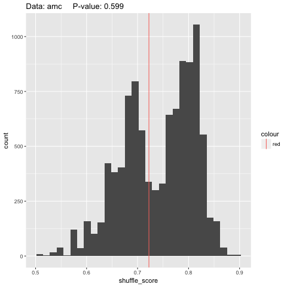 | 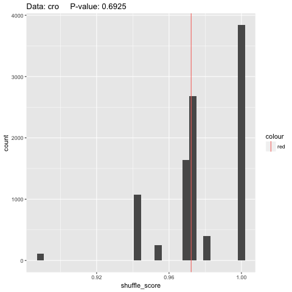 |
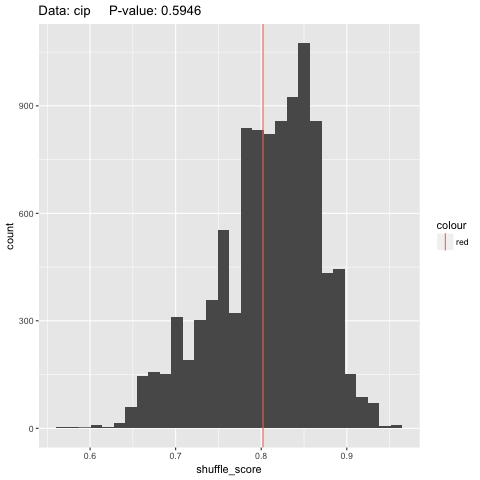 | 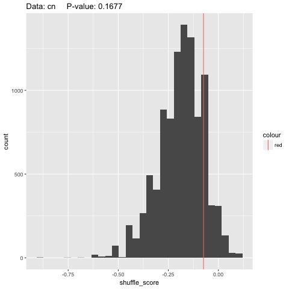 |  |
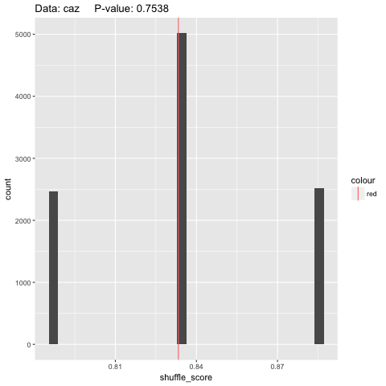 | 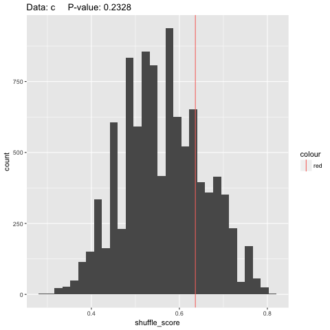 |  |
 | 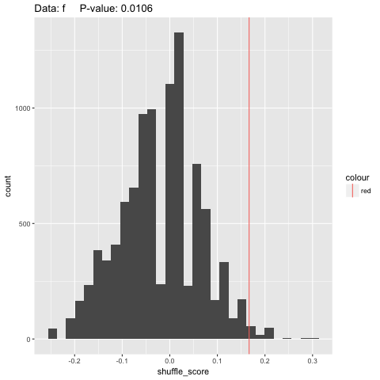 |  |
 
 
Antibiotic | Abbrev. | Antibiotic Group | p-value (tight) | p-value (loose) | |
-----------| ---- | ----------------- | ---------- | ---------- | -----|
ampicillin | amp | $\beta$-lactam |  |  | |
co-amoxiclav | amc | $\beta$-lactam |  |  | |
ceftriaxone | cro | cephalosporin | | | |
ciprofloxacin | cip | quinolones | | | |
gentamicin | cn | aminoglycosides | | | |
co-trimoxazole | sxt | sulfanomides | | | |
ceftaxidime | caz | cephalosporins | | | |
chloramphenicol | c | chloramphenicol |  |  | |
imipenem | ipm | carbapenem | - | - | |
cefpodoxime | cpd | cephalosporins |  |  | |
nitrofurantoin | f | nitrofuran |  |  |  |
