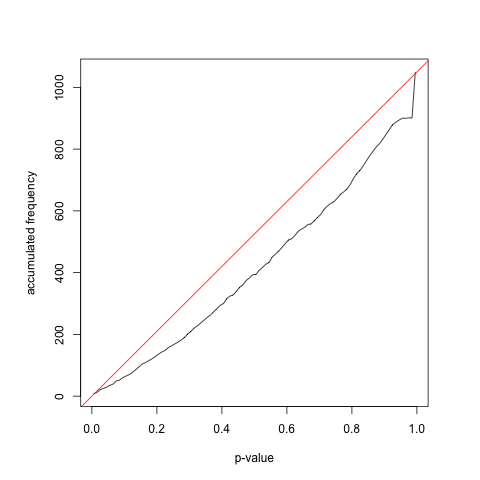
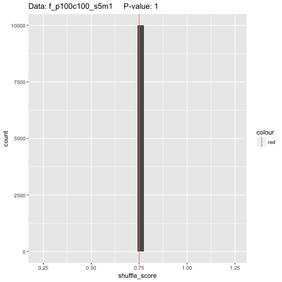
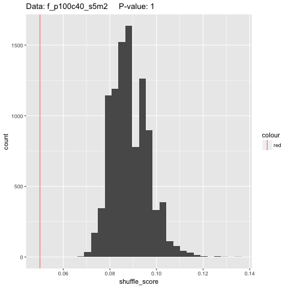

### Start analysis, load dependencies and functions

```{r dependencies, message=FALSE}
setwd('~/Desktop/Cambodia_Neonatal/Plasmid_ST_Permutation_Test/validation')

library(plyr)
library(dplyr)
library(tidyr)
library(ggplot2)
```

```{r init, echo = FALSE}
permute_iter = 1e4
```

```{r functions, echo=FALSE}
source('../functions.R')
```

### Validation

#### Check null hypothesis

The null hypothesis is based on datasets generated given different probabilities of finding a plasmid in different STs. This is to look at possible artifacts when data is generated from a model with no relation between STs.

```{r merge tables, include=FALSE}
# FIA

p_FIA_1 = read.table("FIA_1.txt", sep="\t")
p_FIA_2 = read.table("FIA_2.txt", sep="\t")
p_FIA_3 = read.table("FIA_3.txt", sep="\t")

p_FIA = rbind(p_FIA_1, p_FIA_2, p_FIA_3)

# FIIK

#p_FIIK_1 = read.table("FIIK_1.txt", sep="\t")
#p_FIIK_2 = read.table("FIIK_2.txt", sep="\t")
#p_FIIK_3 = read.table("FIIK_3.txt", sep="\t")

#p_FIIK = rbind(p_FIIK_1, p_FIIK_2, p_FIIK_3)
```

```{r proportions, include=FALSE}

png("./p_distribution.png")
hist(p_FIA$x, breaks = 100, main = "p-value distibution of FIA plasmid", xlab = "p-value")
dev.off()

a <- hist(p_FIA$x, breaks = 100)
b <- cumsum(a$counts)

png("./proportion.png")
par(pty="s")
plot(a$mids, b, type='l', xlab = "p-value", ylab = "accumulated frequency")
abline(a = 0, b = 1050, col="red")
dev.off()
```




#### Effect of sample number per patient

Because regardless of how many samples collected of each ST, we only check for whether plasmid is ever present in that ST or not (OR between all samples). Sample number per patient has no effect here based on the algorithm chosen. Should sample number have effect than another method to quantify likelihood would need to be devised.
 
 
##### Effect of prevalence of plasmid in population (coverage percentage)

```{r varied coverage sim, include=FALSE, cache=TRUE}
### s5m0

genfixedSTdf(n_patients = 100, percent = 100, n_avgST = 5, missing= 0)
f_p100c100_s5m0_plot <- plasmidSTpermute(f_p100c100_s5m0, permute_iter)
png("./sim_permute_results/f_p100c100_s5m0.png")
print(f_p100c100_s5m0_plot)
dev.off()

genfixedSTdf(n_patients = 100, percent = 80, n_avgST = 5, missing= 0)
f_p100c80_s5m0_plot <- plasmidSTpermute(f_p100c80_s5m0, permute_iter)
png("./sim_permute_results/f_p100c80_s5m0.png")
print(f_p100c80_s5m0_plot)
dev.off()

genfixedSTdf(n_patients = 100, percent = 60, n_avgST = 5, missing= 0)
f_p100c60_s5m0_plot <- plasmidSTpermute(f_p100c60_s5m0, permute_iter)
png("./sim_permute_results/f_p100c60_s5m0.png")
print(f_p100c60_s5m0_plot)
dev.off()

genfixedSTdf(n_patients = 100, percent = 40, n_avgST = 5, missing= 0)
f_p100c40_s5m0_plot <- plasmidSTpermute(f_p100c40_s5m0, permute_iter)
png("./sim_permute_results/f_p100c40_s5m0.png")
print(f_p100c40_s5m0_plot)
dev.off()

genfixedSTdf(n_patients = 100, percent = 20, n_avgST = 5, missing= 0)
f_p100c20_s5m0_plot <- plasmidSTpermute(f_p100c20_s5m0, permute_iter)
png("./sim_permute_results/f_p100c20_s5m0.png")
print(f_p100c20_s5m0_plot)
dev.off()

genfixedSTdf(n_patients = 100, percent = 0, n_avgST = 5, missing= 0)
f_p100c0_s5m0_plot <- plasmidSTpermute(f_p100c0_s5m0, permute_iter)
png("./sim_permute_results/f_p100c0_s5m0.png")
print(f_p100c0_s5m0_plot)
dev.off()

### s5m1

genfixedSTdf(n_patients = 100, percent = 100, n_avgST = 5, missing= 1)
f_p100c100_s5m1_plot <- plasmidSTpermute(f_p100c100_s5m1, permute_iter)
png("./sim_permute_results/f_p100c100_s5m1.png")
print(f_p100c100_s5m1_plot)
dev.off()

genfixedSTdf(n_patients = 100, percent = 80, n_avgST = 5, missing= 1)
f_p100c80_s5m1_plot <- plasmidSTpermute(f_p100c80_s5m1, permute_iter)
png("./sim_permute_results/f_p100c80_s5m1.png")
print(f_p100c80_s5m1_plot)
dev.off()

genfixedSTdf(n_patients = 100, percent = 60, n_avgST = 5, missing= 1)
f_p100c60_s5m1_plot <- plasmidSTpermute(f_p100c60_s5m1, permute_iter)
png("./sim_permute_results/f_p100c60_s5m1.png")
print(f_p100c60_s5m1_plot)
dev.off()

genfixedSTdf(n_patients = 100, percent = 40, n_avgST = 5, missing= 1)
f_p100c40_s5m1_plot <- plasmidSTpermute(f_p100c40_s5m1, permute_iter)
png("./sim_permute_results/f_p100c40_s5m1.png")
print(f_p100c40_s5m1_plot)
dev.off()

genfixedSTdf(n_patients = 100, percent = 20, n_avgST = 5, missing= 1)
f_p100c20_s5m1_plot <- plasmidSTpermute(f_p100c20_s5m1, permute_iter)
png("./sim_permute_results/f_p100c20_s5m1.png")
print(f_p100c20_s5m1_plot)
dev.off()

genfixedSTdf(n_patients = 100, percent = 0, n_avgST = 5, missing= 1)
f_p100c0_s5m1_plot <- plasmidSTpermute(f_p100c0_s5m1, permute_iter)
png("./sim_permute_results/f_p100c0_s5m1.png")
print(f_p100c0_s5m1_plot)
dev.off()

### s5m2

genfixedSTdf(n_patients = 100, percent = 100, n_avgST = 5, missing= 2)
f_p100c100_s5m2_plot <- plasmidSTpermute(f_p100c100_s5m2, permute_iter)
png("./sim_permute_results/f_p100c100_s5m2.png")
print(f_p100c100_s5m2_plot)
dev.off()

genfixedSTdf(n_patients = 100, percent = 80, n_avgST = 5, missing= 2)
f_p100c80_s5m2_plot <- plasmidSTpermute(f_p100c80_s5m2, permute_iter)
png("./sim_permute_results/f_p100c80_s5m2.png")
print(f_p100c80_s5m2_plot)
dev.off()

genfixedSTdf(n_patients = 100, percent = 60, n_avgST = 5, missing= 2)
f_p100c60_s5m2_plot <- plasmidSTpermute(f_p100c60_s5m2, permute_iter)
png("./sim_permute_results/f_p100c60_s5m2.png")
print(f_p100c60_s5m2_plot)
dev.off()

genfixedSTdf(n_patients = 100, percent = 40, n_avgST = 5, missing= 2)
f_p100c40_s5m2_plot <- plasmidSTpermute(f_p100c40_s5m2, permute_iter)
png("./sim_permute_results/f_p100c40_s5m2.png")
print(f_p100c40_s5m2_plot)
dev.off()

genfixedSTdf(n_patients = 100, percent = 20, n_avgST = 5, missing= 2)
f_p100c20_s5m2_plot <- plasmidSTpermute(f_p100c20_s5m2, permute_iter)
png("./sim_permute_results/f_p100c20_s5m2.png")
print(f_p100c20_s5m2_plot)
dev.off()

genfixedSTdf(n_patients = 100, percent = 0, n_avgST = 5, missing= 2)
f_p100c0_s5m2_plot <- plasmidSTpermute(f_p100c0_s5m2, permute_iter)
png("./sim_permute_results/f_p100c0_s5m2.png")
print(f_p100c0_s5m2_plot)
dev.off()

### s5m3

genfixedSTdf(n_patients = 100, percent = 100, n_avgST = 5, missing= 3)
f_p100c100_s5m3_plot <- plasmidSTpermute(f_p100c100_s5m3, permute_iter)
png("./sim_permute_results/f_p100c100_s5m3.png")
print(f_p100c100_s5m3_plot)
dev.off()

genfixedSTdf(n_patients = 100, percent = 80, n_avgST = 5, missing= 3)
f_p100c80_s5m3_plot <- plasmidSTpermute(f_p100c80_s5m3, permute_iter)
png("./sim_permute_results/f_p100c80_s5m3.png")
print(f_p100c80_s5m3_plot)
dev.off()

genfixedSTdf(n_patients = 100, percent = 60, n_avgST = 5, missing= 3)
f_p100c60_s5m3_plot <- plasmidSTpermute(f_p100c60_s5m3, permute_iter)
png("./sim_permute_results/f_p100c60_s5m3.png")
print(f_p100c60_s5m3_plot)
dev.off()

genfixedSTdf(n_patients = 100, percent = 40, n_avgST = 5, missing= 3)
f_p100c40_s5m3_plot <- plasmidSTpermute(f_p100c40_s5m3, permute_iter)
png("./sim_permute_results/f_p100c40_s5m3.png")
print(f_p100c40_s5m3_plot)
dev.off()

genfixedSTdf(n_patients = 100, percent = 20, n_avgST = 5, missing= 3)
f_p100c20_s5m3_plot <- plasmidSTpermute(f_p100c20_s5m3, permute_iter)
png("./sim_permute_results/f_p100c20_s5m3.png")
print(f_p100c20_s5m3_plot)
dev.off()

genfixedSTdf(n_patients = 100, percent = 0, n_avgST = 5, missing= 3)
f_p100c0_s5m3_plot <- plasmidSTpermute(f_p100c0_s5m3, permute_iter)
png("./sim_permute_results/f_p100c0_s5m3.png")
print(f_p100c0_s5m3_plot)
dev.off()

### s5m4

genfixedSTdf(n_patients = 100, percent = 100, n_avgST = 5, missing= 4)
f_p100c100_s5m4_plot <- plasmidSTpermute(f_p100c100_s5m4, permute_iter)
png("./sim_permute_results/f_p100c100_s5m4.png")
print(f_p100c100_s5m4_plot)
dev.off()

genfixedSTdf(n_patients = 100, percent = 80, n_avgST = 5, missing= 4)
f_p100c80_s5m4_plot <- plasmidSTpermute(f_p100c80_s5m4, permute_iter)
png("./sim_permute_results/f_p100c80_s5m4.png")
print(f_p100c80_s5m4_plot)
dev.off()

genfixedSTdf(n_patients = 100, percent = 60, n_avgST = 5, missing= 4)
f_p100c60_s5m4_plot <- plasmidSTpermute(f_p100c60_s5m4, permute_iter)
png("./sim_permute_results/f_p100c60_s5m4.png")
print(f_p100c60_s5m4_plot)
dev.off()

genfixedSTdf(n_patients = 100, percent = 40, n_avgST = 5, missing= 4)
f_p100c40_s5m4_plot <- plasmidSTpermute(f_p100c40_s5m4, permute_iter)
png("./sim_permute_results/f_p100c40_s5m4.png")
print(f_p100c40_s5m4_plot)
dev.off()

genfixedSTdf(n_patients = 100, percent = 20, n_avgST = 5, missing= 4)
f_p100c20_s5m4_plot <- plasmidSTpermute(f_p100c20_s5m4, permute_iter)
png("./sim_permute_results/f_p100c20_s5m4.png")
print(f_p100c20_s5m4_plot)
dev.off()

genfixedSTdf(n_patients = 100, percent = 0, n_avgST = 5, missing= 4)
f_p100c0_s5m4_plot <- plasmidSTpermute(f_p100c0_s5m4, permute_iter)
png("./sim_permute_results/f_p100c0_s5m4.png")
print(f_p100c0_s5m4_plot)
dev.off()

```

```{r print 3, include=FALSE}
### s5m0

png("./sim_permute_results/f_p100c100_s5m0.png")
print(f_p100c100_s5m0_plot)
dev.off()

png("./sim_permute_results/f_p100c80_s5m0.png")
print(f_p100c80_s5m0_plot)
dev.off()

png("./sim_permute_results/f_p100c60_s5m0.png")
print(f_p100c60_s5m0_plot)
dev.off()

png("./sim_permute_results/f_p100c40_s5m0.png")
print(f_p100c40_s5m0_plot)
dev.off()

png("./sim_permute_results/f_p100c20_s5m0.png")
print(f_p100c20_s5m0_plot)
dev.off()

png("./sim_permute_results/f_p100c0_s5m0.png")
print(f_p100c0_s5m0_plot)
dev.off()

###s5m1

png("./sim_permute_results/f_p100c100_s5m1.png")
print(f_p100c100_s5m1_plot)
dev.off()

png("./sim_permute_results/f_p100c80_s5m1.png")
print(f_p100c80_s5m1_plot)
dev.off()

png("./sim_permute_results/f_p100c60_s5m1.png")
print(f_p100c60_s5m1_plot)
dev.off()

png("./sim_permute_results/f_p100c40_s5m1.png")
print(f_p100c40_s5m1_plot)
dev.off()

png("./sim_permute_results/f_p100c20_s5m1.png")
print(f_p100c20_s5m1_plot)
dev.off()

png("./sim_permute_results/f_p100c0_s5m1.png")
print(f_p100c0_s5m1_plot)
dev.off()

### s5m2

png("./sim_permute_results/f_p100c100_s5m2.png")
print(f_p100c100_s5m2_plot)
dev.off()

png("./sim_permute_results/f_p100c80_s5m2.png")
print(f_p100c80_s5m2_plot)
dev.off()

png("./sim_permute_results/f_p100c60_s5m2.png")
print(f_p100c60_s5m2_plot)
dev.off()

png("./sim_permute_results/f_p100c40_s5m2.png")
print(f_p100c40_s5m2_plot)
dev.off()

png("./sim_permute_results/f_p100c20_s5m2.png")
print(f_p100c20_s5m2_plot)
dev.off()

png("./sim_permute_results/f_p100c0_s5m2.png")
print(f_p100c0_s5m2_plot)
dev.off()

### s5m3

png("./sim_permute_results/f_p100c100_s5m3.png")
print(f_p100c100_s5m3_plot)
dev.off()

png("./sim_permute_results/f_p100c80_s5m3.png")
print(f_p100c80_s5m3_plot)
dev.off()

png("./sim_permute_results/f_p100c60_s5m3.png")
print(f_p100c60_s5m3_plot)
dev.off()

png("./sim_permute_results/f_p100c40_s5m3.png")
print(f_p100c40_s5m3_plot)
dev.off()

png("./sim_permute_results/f_p100c20_s5m3.png")
print(f_p100c20_s5m3_plot)
dev.off()

png("./sim_permute_results/f_p100c0_s5m3.png")
print(f_p100c0_s5m3_plot)
dev.off()

### s5m4

png("./sim_permute_results/f_p100c100_s5m4.png")
print(f_p100c100_s5m4_plot)
dev.off()

png("./sim_permute_results/f_p100c80_s5m4.png")
print(f_p100c80_s5m4_plot)
dev.off()

png("./sim_permute_results/f_p100c60_s5m4.png")
print(f_p100c60_s5m4_plot)
dev.off()

png("./sim_permute_results/f_p100c40_s5m4.png")
print(f_p100c40_s5m4_plot)
dev.off()

png("./sim_permute_results/f_p100c20_s5m4.png")
print(f_p100c20_s5m4_plot)
dev.off()

png("./sim_permute_results/f_p100c0_s5m4.png")
print(f_p100c0_s5m4_plot)
dev.off()
```

Coverage percent is, from the entire sample population, how many patients (in percent) will have the plasmid. Where 100 percent would mean everyone has the plasmid, and 0 percent is where no one has the plasmid at all.
 
We look at the effect of coverage at varied scenarios given a fixed number of average ST per patient. For example, suppose a patient was found to have 5 STs (or 5 STs on average), but only 3/5 of their STs had the plasmid we are looking for. This is compared to the case where a patient would have 5 STs again (fixed), but 1/5 of their STs has the plasmid in question. And 2/5, and so on.  
 
Coverage percentage | 100 | 80 | 60 | 40 | 20 |
---| -----|----|----|----|----|
Num STs with plasmid/Average ST per patient |
5/5 | |  |  |  |  |
4/5 | |  |  |  |  |
3/5 | |  |  |  |  |
2/5 | |  |  |  |  |
1/5 | |  |  |  |  |  


##### Effect of average number of STs per patient

We consider the effect of different average number of STs at a fixed coverage of 60 (not too high, not too low). First, confirm from previous section that high ratios of ST with plasmid/ST will always return a positive on test.

```{r varied ST per patient high ratio sim, include=FALSE, cache=TRUE}
# 10

genfixedSTdf(n_patients = 100, percent = 60, n_avgST = 10, missing= 1)
f_p100c60_s10m1_plot <- plasmidSTpermute(f_p100c60_s10m1, permute_iter)
png("./sim_permute_results/f_p100c60_s10m9.png")
print(f_p100c60_s10m1_plot)
dev.off()

genfixedSTdf(n_patients = 100, percent = 60, n_avgST = 10, missing= 2)
f_p100c60_s10m2_plot <- plasmidSTpermute(f_p100c60_s10m2, permute_iter)
png("./sim_permute_results/f_p100c60_s10m2.png")
print(f_p100c60_s10m2_plot)
dev.off()

genfixedSTdf(n_patients = 100, percent = 60, n_avgST = 10, missing= 3)
f_p100c60_s10m3_plot <- plasmidSTpermute(f_p100c60_s10m3, permute_iter)
png("./sim_permute_results/f_p100c60_s10m3.png")
print(f_p100c60_s10m3_plot)
dev.off()

genfixedSTdf(n_patients = 100, percent = 60, n_avgST = 10, missing= 4)
f_p100c60_s10m4_plot <- plasmidSTpermute(f_p100c60_s10m4, permute_iter)
png("./sim_permute_results/f_p100c60_s10m4.png")
print(f_p100c60_s10m4_plot)
dev.off()

genfixedSTdf(n_patients = 100, percent = 60, n_avgST = 10, missing= 5)
f_p100c60_s10m5_plot <- plasmidSTpermute(f_p100c60_s10m5, permute_iter)
png("./sim_permute_results/f_p100c60_s10m5.png")
print(f_p100c60_s10m5_plot)
dev.off()

# 50

genfixedSTdf(n_patients = 100, percent = 60, n_avgST = 50, missing= 1)
f_p100c60_s50m1_plot <- plasmidSTpermute(f_p100c60_s50m1, permute_iter)
png("./sim_permute_results/f_p100c60_s50m1.png")
print(f_p100c60_s50m1_plot)
dev.off()

genfixedSTdf(n_patients = 100, percent = 60, n_avgST = 50, missing= 2)
f_p100c60_s50m2_plot <- plasmidSTpermute(f_p100c60_s50m2, permute_iter)
png("./sim_permute_results/f_p100c60_s50m2.png")
print(f_p100c60_s50m2_plot)
dev.off()

genfixedSTdf(n_patients = 100, percent = 60, n_avgST = 50, missing= 10)
f_p100c60_s50m10_plot <- plasmidSTpermute(f_p100c60_s50m10, permute_iter)
png("./sim_permute_results/f_p100c60_s50m10.png")
print(f_p100c60_s50m10_plot)
dev.off()

genfixedSTdf(n_patients = 100, percent = 60, n_avgST = 50, missing= 20)
f_p100c60_s50m20_plot <- plasmidSTpermute(f_p100c60_s50m20, permute_iter)
png("./sim_permute_results/f_p100c60_s50m20.png")
print(f_p100c60_s50m20_plot)
dev.off()

genfixedSTdf(n_patients = 100, percent = 60, n_avgST = 50, missing= 25)
f_p100c60_s50m25_plot <- plasmidSTpermute(f_p100c60_s50m25, permute_iter)
png("./sim_permute_results/f_p100c60_s50m25.png")
print(f_p100c60_s50m25_plot)
dev.off()

```

```{r print 4, include=FALSE}
# 10

png("./sim_permute_results/f_p100c60_s10m1.png")
print(f_p100c60_s10m1_plot)
dev.off()

png("./sim_permute_results/f_p100c60_s10m2.png")
print(f_p100c60_s10m2_plot)
dev.off()

png("./sim_permute_results/f_p100c60_s10m3.png")
print(f_p100c60_s10m3_plot)
dev.off()

png("./sim_permute_results/f_p100c60_s10m4.png")
print(f_p100c60_s10m4_plot)
dev.off()

png("./sim_permute_results/f_p100c60_s10m5.png")
print(f_p100c60_s10m5_plot)
dev.off()

# 50

png("./sim_permute_results/f_p100c60_s50m1.png")
print(f_p100c60_s50m1_plot)
dev.off()

png("./sim_permute_results/f_p100c60_s50m2.png")
print(f_p100c60_s50m2_plot)
dev.off()

png("./sim_permute_results/f_p100c60_s50m10.png")
print(f_p100c60_s50m10_plot)
dev.off()

png("./sim_permute_results/f_p100c60_s50m20.png")
print(f_p100c60_s50m20_plot)
dev.off()

png("./sim_permute_results/f_p100c60_s50m25.png")
print(f_p100c60_s50m25_plot)
dev.off()
```

Average number of ST | 5 | 10 | 50 |
---------------------|---|----|----|
Ratios |
n/n-1 |  |  |  | 
n/n-2 |  |  |  |
Ratios |
5/4 |  |  |  |
5/3 |  |  |  |

Next, consider ratios (of ST) that are lower than half because we confirmed that at high ratios test will return a highly confident positive. 

```{r varied ST per patient low ratio sim, include=FALSE, cache=TRUE}
# 10

genfixedSTdf(n_patients = 100, percent = 60, n_avgST = 10, missing= 6)
f_p100c60_s10m6_plot <- plasmidSTpermute(f_p100c60_s10m6, permute_iter)
png("./sim_permute_results/f_p100c60_s10m6.png")
print(f_p100c60_s10m6_plot)
dev.off()

genfixedSTdf(n_patients = 100, percent = 60, n_avgST = 10, missing= 7)
f_p100c60_s10m7_plot <- plasmidSTpermute(f_p100c60_s10m7, permute_iter)
png("./sim_permute_results/f_p100c60_s10m7.png")
print(f_p100c60_s10m7_plot)
dev.off()

genfixedSTdf(n_patients = 100, percent = 60, n_avgST = 10, missing= 8)
f_p100c60_s10m8_plot <- plasmidSTpermute(f_p100c60_s10m8, permute_iter)
png("./sim_permute_results/f_p100c60_s10m8.png")
print(f_p100c60_s10m8_plot)
dev.off()

genfixedSTdf(n_patients = 100, percent = 60, n_avgST = 10, missing= 9)
f_p100c60_s10m9_plot <- plasmidSTpermute(f_p100c60_s10m9, permute_iter)
png("./sim_permute_results/f_p100c60_s10m9.png")
print(f_p100c60_s10m9_plot)
dev.off()

# 50

genfixedSTdf(n_patients = 100, percent = 60, n_avgST = 50, missing= 40)
f_p100c60_s50m40_plot <- plasmidSTpermute(f_p100c60_s50m40, permute_iter)
png("./sim_permute_results/f_p100c60_s50m40.png")
print(f_p100c60_s50m40_plot)
dev.off()

genfixedSTdf(n_patients = 100, percent = 60, n_avgST = 50, missing= 45)
f_p100c60_s50m45_plot <- plasmidSTpermute(f_p100c60_s50m45, permute_iter)
png("./sim_permute_results/f_p100c60_s50m45.png")
print(f_p100c60_s50m45_plot)
dev.off()

genfixedSTdf(n_patients = 100, percent = 60, n_avgST = 50, missing= 47)
f_p100c60_s50m47_plot <- plasmidSTpermute(f_p100c60_s50m47, permute_iter)
png("./sim_permute_results/f_p100c60_s50m47.png")
print(f_p100c60_s50m47_plot)
dev.off()

genfixedSTdf(n_patients = 100, percent = 60, n_avgST = 50, missing= 48)
f_p100c60_s50m48_plot <- plasmidSTpermute(f_p100c60_s50m48, permute_iter)
png("./sim_permute_results/f_p100c60_s50m48.png")
print(f_p100c60_s50m48_plot)
dev.off()

genfixedSTdf(n_patients = 100, percent = 60, n_avgST = 50, missing= 49)
f_p100c60_s50m49_plot <- plasmidSTpermute(f_p100c60_s50m49, permute_iter)
png("./sim_permute_results/f_p100c60_s50m49.png")
print(f_p100c60_s50m49_plot)
dev.off()
```

```{r varied ST per patient low ratio sim 2, include=FALSE, cache=TRUE}
genfixedSTdf(n_patients = 100, percent = 60, n_avgST = 50, missing= 30)
f_p100c60_s50m30_plot <- plasmidSTpermute(f_p100c60_s50m30, permute_iter)
```

```{r print 5 ,include=FALSE}
# 10
png("./sim_permute_results/f_p100c60_s10m6.png")
print(f_p100c60_s10m6_plot)
dev.off()

png("./sim_permute_results/f_p100c60_s10m7.png")
print(f_p100c60_s10m7_plot)
dev.off()

png("./sim_permute_results/f_p100c60_s10m8.png")
print(f_p100c60_s10m8_plot)
dev.off()

png("./sim_permute_results/f_p100c60_s10m9.png")
print(f_p100c60_s10m9_plot)
dev.off()

# 50

png("./sim_permute_results/f_p100c60_s50m30.png")
print(f_p100c60_s50m30_plot)
dev.off()

png("./sim_permute_results/f_p100c60_s50m40.png")
print(f_p100c60_s50m40_plot)
dev.off()

png("./sim_permute_results/f_p100c60_s50m45.png")
print(f_p100c60_s50m45_plot)
dev.off()

png("./sim_permute_results/f_p100c60_s50m47.png")
print(f_p100c60_s50m47_plot)
dev.off()

png("./sim_permute_results/f_p100c60_s50m48.png")
print(f_p100c60_s50m48_plot)
dev.off()

png("./sim_permute_results/f_p100c60_s50m49.png")
print(f_p100c60_s50m49_plot)
dev.off()
```

Average number of ST | 5 | 10 | 50 |
---------------------|---|----|----|
Ratios |
n/1 |  |  |  |
n/2 |  |  |  |
n/3 |  |  |  |
Ratios |
5/1 |  |  |  |
5/2 |  |  |  |
